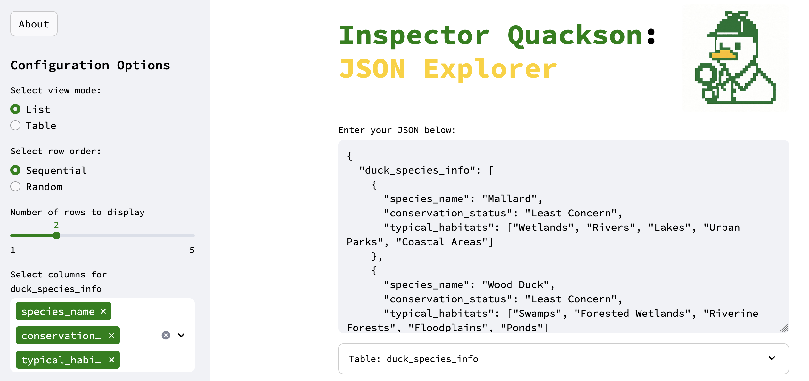
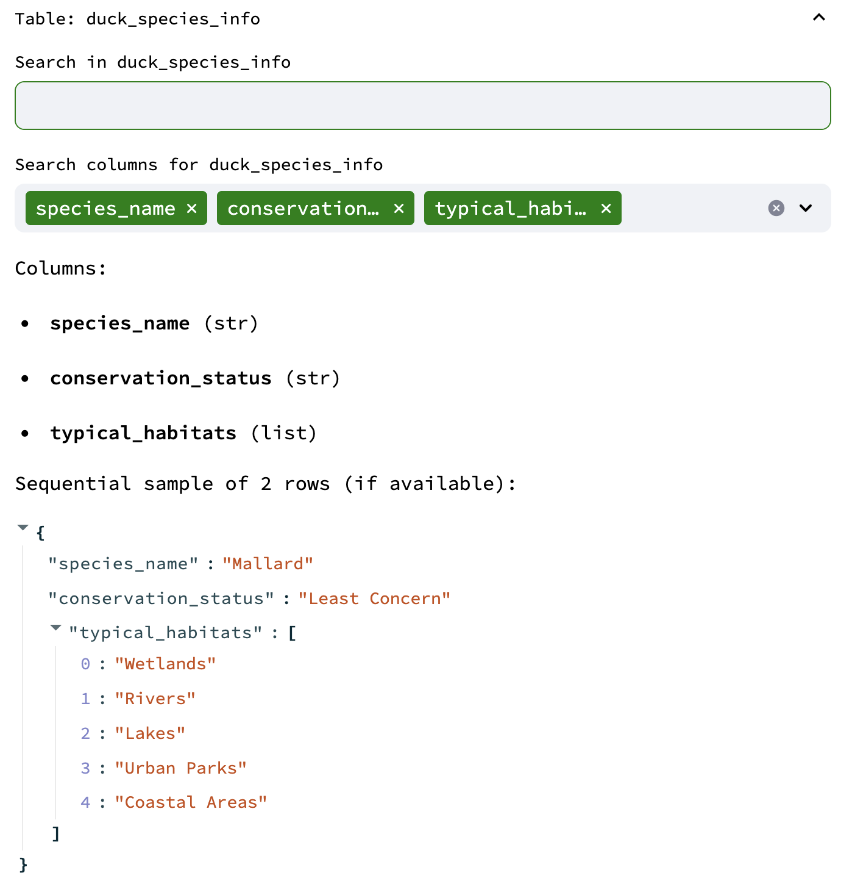
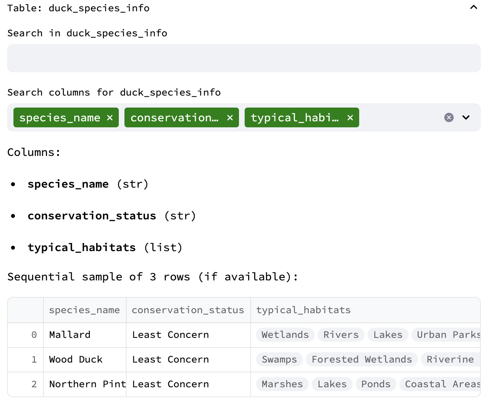
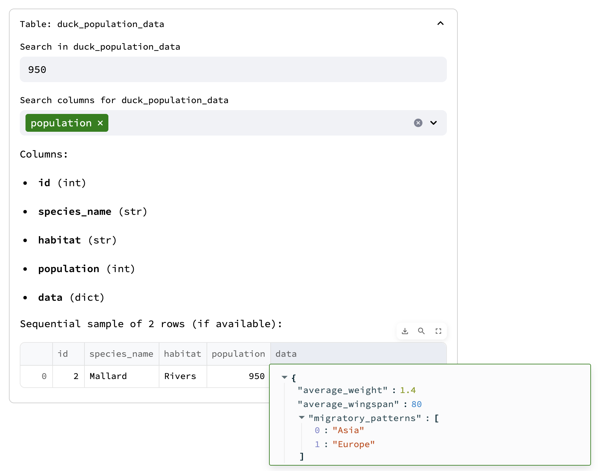

# Inspector Quackson: JSON Explorer 


**Inspector Quackson** is a lightweight Streamlit-based tool that allows users to explore JSON datasets in an interactive and visual way. This app was created with the intention to explore JSON on your local machine, especially when working with sensitive data.

---

## Features

- Load and parse structured JSON files.
- Search across selected columns in each table.
- View data in either **List** or **Table** format.
- Choose between **Sequential** or **Random** row sampling.
- Dynamically select which columns are displayed.
- "About" dialog loaded from external file.
- Animated loading screen with detective duck images.

---

Note: If you are a Snowflake user, I created a Snowflake friendly version in `snowflake_friendly_json_parser.py`. 

## How It Works

### 1. Load Your Data
You can paste or edit your JSON in the input area. The app expects a dictionary where each key is a table name, and its value is a list of row dictionaries.

Example format:
```json
{
  "duck_species_info": [
    {"species_name": "Mallard", "conservation_status": "Least Concern"},
    {"species_name": "Wood Duck", "conservation_status": "Least Concern"}
  ]
}
```

### 2. Configure Display Options
Use the sidebar to customize:

- **View Mode**: `List` or `Table`
- **Row Order**: `Sequential` or `Random`
- **Number of Rows**: `n rows`
- **Columns to Display**: Multiselect per table

### 3. Interact and Search
Each table appears in an expandable section. You can:

- View column names and types
- Filter rows by search term
- Select which columns to include in the output

### 4. To add if I ever find time

Expand the data output to provide summary information, such as % fill of a column. JSON responses do not always provide data for a given field, which can lead you to "miss" whether a column is present.

There's probably a better way to parse the data more efficiently, too.

## How to Run

Install dependencies and launch:

```bash
streamlit run app.py
```

---

## Sample Screenshots

### Interface


### List View Mode


### Table View Mode


### Filtered List View



